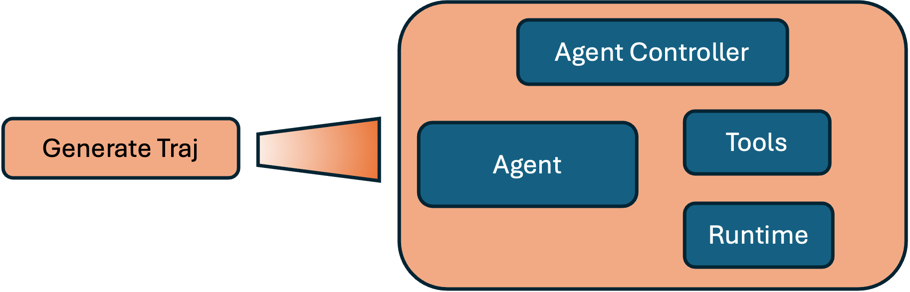
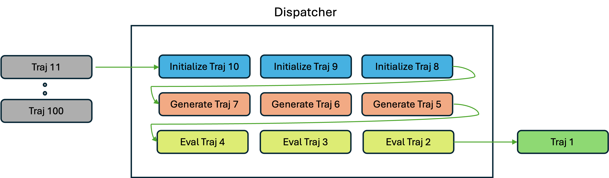

SkyAgent Overview
====================

SkyAgent is a generic agent layer for training and evaluating agents. It is a flexible frontend for building your own agents. 

SkyAgent is designed primarily for researchers to have a unified interface around implementing agentic tasks. A modular design allows researchers to

1. Bring in their own tasks
2. Use any training backend or simply run evaluation
3. Modify runtime implementation for a given task (docker, etc)
4. Improve dispatching logic for a batch of trajectories easily
5. And more ...

.. warning::
    
    ⚠️ SkyAgent is still under active development. We welcome any early feedback and contributions. 

Examples
--------

We have a few examples in the ``examples`` folder: 

1. `Evaluation: OpenAI <https://github.com/NovaSky-AI/SkyRL/tree/bd9d6a9bace82df5e27c81ab231f5f4a17b2cf5b/skyagent/examples/run_openai>`_: This example shows how to run evaluation with an OpenAI compatible endpoint.
2. `Training: SkyAgent and SkyRL-train <https://github.com/NovaSky-AI/SkyRL/tree/bd9d6a9bace82df5e27c81ab231f5f4a17b2cf5b/skyagent/examples/run_skyrl>`_ : Training a model on the SWEBench task with SkyRL-train.
3. `Training: SkyAgent and VeRL <https://github.com/NovaSky-AI/SkyRL/tree/bd9d6a9bace82df5e27c81ab231f5f4a17b2cf5b/skyagent/examples/run_verl>`_ : Training a model on the SWEBench task with VeRL.

Core components
---------------

SkyAgent consists of the following components:

1. `AgentRunner <https://github.com/NovaSky-AI/SkyRL/blob/bd9d6a9bace82df5e27c81ab231f5f4a17b2cf5b/skyagent/skyagent/agents/base.py#L89>`_ : The main entrypoint for Skyagent is the AgentRunner class - it's responsible for generating trajectories for the given batch of prompts
2. `Trajectory <https://github.com/NovaSky-AI/SkyRL/blob/bd9d6a9bace82df5e27c81ab231f5f4a17b2cf5b/skyagent/skyagent/agents/base.py#L61C7-L61C21>`_ : the trajectory class handles generating a single trajectory for the given instance from the batch. 
3. `Agent <https://github.com/NovaSky-AI/SkyRL/blob/bd9d6a9bace82df5e27c81ab231f5f4a17b2cf5b/skyagent/skyagent/agents/react/react_agent.py#L15>`_ : This is simply an LLM with the ability to call tools. 
4. `Task <https://github.com/NovaSky-AI/SkyRL/blob/bd9d6a9bace82df5e27c81ab231f5f4a17b2cf5b/skyagent/skyagent/tasks/base.py#L7>`_ : The task class contains the task specification such as initial instruction, how the agent's runtime should be setup, how to evaluate results, etc. 
5. `Dispatcher <https://github.com/NovaSky-AI/SkyRL/blob/bd9d6a9bace82df5e27c81ab231f5f4a17b2cf5b/skyagent/skyagent/dispatcher/dispatchers.py#L20>`_ : the dispatcher is responsible for efficiently handling trajectory execution for a batch of prompts. 
6. `Backend <https://github.com/NovaSky-AI/SkyRL/blob/bd9d6a9bace82df5e27c81ab231f5f4a17b2cf5b/skyagent/skyagent/integrations/base.py#L5>`_ : Backend is the LLM backend for generating responses. For example, vLLM for inference or ``SkyRL-train``'s inference engines for training.

Trajectory
----------

The trajectory class handles generating a single trajectory for the given instance from the batch. It has three methods:

1. ``initialize_trajectory``: Initialize the trajectory eg: setup any runtime environment needed for the agent to run.
2. ``generate_trajectory``: Generate the trajectory i.e. run the agent loop and get the final conversation and task results. 
3. ``evaluate_trajectory``: Evaluate the trajectory i.e. parse the final result and evaluate it for the given task.

The results of both ``generate_trajectory`` and ``evaluate_trajectory`` are stored in a ``.result`` attribute of the trajectory. Each trajectory instance will initialize an ``Agent`` instance to generate responses.

Here's a high-level diagram of the components involved in generating a trajectory:

Agent
-----

The agent class is a simple wrapper around an LLM with the ability to call tools. It mainly has a ``step`` method that generates an assistant response to the current history. The agent class manages history and response parsing. The actual LLM call is handled by the backend. 

Backend
-------

The backend is the LLM backend for generating responses. For example, this can be an `OpenAI-compatible webserver <https://github.com/NovaSky-AI/SkyRL/blob/bd9d6a9bace82df5e27c81ab231f5f4a17b2cf5b/skyagent/skyagent/integrations/openai.py#L15>`_ for inference or `SkyRL-train <https://github.com/NovaSky-AI/SkyRL/blob/bd9d6a9bace82df5e27c81ab231f5f4a17b2cf5b/skyagent/skyagent/integrations/skyrl_train/skyrl_train_backend.py#L5>`_ for training. 

Dispatcher
----------

The dispatcher handles the actual execution of a batch of trajectories efficiently. It takes in a batch of trajectories and executes ``initialize_trajectory``, ``generate_trajectory``, and ``evaluate_trajectory`` for each trajectory in certain concurrency. 

For example, we provide a pipelined dispatcher that can run multiple trajectories in parallel with a maximum concurrency per stage (initialize, generate, evaluate) of ``max_parallel_agents``. 

   Overview of the pipelined dispatcher with ``max_parallel_agents=3``

Task
----

The task class has the following methods:

1. ``initialize_runtime``: Initialize the runtime for the task in an asyncio-compatible way
2. ``get_instruction``: Get the initial instruction for the agent in the OpenAI messages format
3. ``complete_runtime``: Complete or finalize the runtime for the task.  For example, this can involve extracting the git patch from the runtime for SWEBench.
4. ``evaluate_result``: Evaluate model result for the task in an asyncio-compatible way

We currently provide two tasks:

1. `SWEBenchTask <https://github.com/NovaSky-AI/SkyRL/blob/bd9d6a9bace82df5e27c81ab231f5f4a17b2cf5b/skyagent/skyagent/tasks/swebench/utils.py#L341>`_ : Implements the SWEBench task leveraging `OpenHands <https://github.com/All-Hands-AI/OpenHands>`_ .
2. `GeneralReactTask <https://github.com/NovaSky-AI/SkyRL/blob/bd9d6a9bace82df5e27c81ab231f5f4a17b2cf5b/skyagent/skyagent/tasks/general_react/utils.py#L7>`_ : A general task implementation for many basic reasoning tasks like math, science, simple code generation, etc. 
